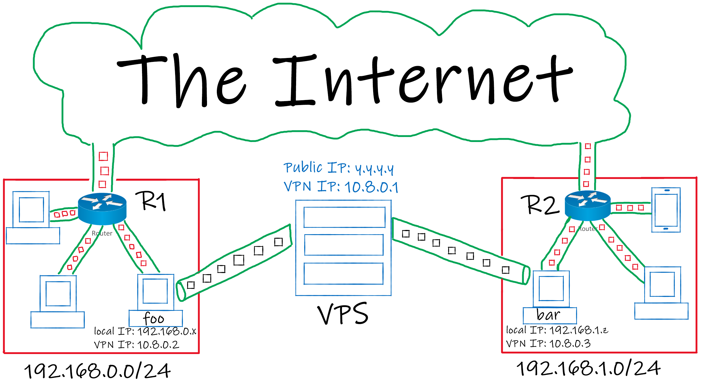

# Site to Site topology (WireGuard)
A Site to Site topology connects 2 (or more) netowrks together using VPN.

To achieve this, in most cases you can make this connection directly between the networks (with the help of `port forwarding`) but in some cases those network can be behind a Carrier-Grade NAT `CG-NAT`, this repo is here to help you in this situation.

At the end of this tutorial we will have 2 networks connected together.

We will use a VPS to run a VPN Server that is publicly accessible, then we can connect to that server from `foo` (a local machine inside `site a`) and `bar` (a local machine inside `site b`) and with some tweaks we can make any machine in `site a` communicate with any machine in `site b` and vice versa.



## VPS configuration
* first, install `WireGuard` from the package manager.

    Ubuntu / Debian :
    ```
    sudo apt install wireguard
    ```
    Arch :
    ```
    sudo pacman -S wireguard-tools
    ```

    if you've chosen a different distro you can always seek guidence from WireGuard's [website](https://www.wireguard.com/install/ "https://www.wireguard.com/install/").

* then, generate public and private keys using this command:
    ```
    wg genkey | tee privatekey | wg pubkey > publickey
    ```
    you will have those keys generated in the current folder (directory).
* Use `middle_server/wg0.conf` file as a template and copy it to `/etc/wireguard` (may require root privileges).

* **Allow port `51820` udp on the firewall to accept connections from anywhere.**

## foo configuration (site a)
* Install `WireGuard` on your machine.
* Generate public and private keys using the same command (if you are using windows don't use `cmd` , use `powershell` instead to generate the keys).
* Use `foo/wg0.conf` file as a template and copy it to `/etc/wireguard` (if you are using windows import the config file into the WireGuard application).
* If `foo` is not the default gateway of its network then add a static route to the gateway (`R1` in the figure) to forward `192.168.1.0/24` (`site b` network address) packets to `foo`.

## bar configuration (site b)
* Install `WireGuard` on your machine.
* Generate public and private keys using the same command (if you are using windows don't use `cmd` , use `powershell` instead to generate the keys).
* Use `bar/wg0.conf` file as a template and copy it to `/etc/wireguard` (if you are using windows import the config file into the WireGuard application).
* If `bar` is not the default gateway of its network then add a static route to the gateway (`R2` in the figure) to forward `192.168.0.0/24` (`site a` network address) packets to `bar`.

## Connection
After configuring the machines you can now establish a connection using this command:
```
sudo wg-quick up wg0
```
(if you are using windows press the `Activate` button on the WireGuard application).

If everything is configured properly then `site a` and `site b` can communicate with each other as a single network.

If you're having any issues connecting to the VPN server even though you're sure everything is configured properly then one of the reasons is that your country is probably applying Deep Packet Inspection `DPI` which gives them the power to distinguish WireGuard traffic and drop it.

## REF
* DPI: https://en.wikipedia.org/wiki/Deep_packet_inspection
* CG-NAT: https://www.sidn.nl/en/news-and-blogs/cgnat-frustrates-all-ip-address-based-technologies
* WireGuard: https://www.wireguard.com/
* Site to Site topolgy: https://www.procustodibus.com/blog/2020/12/wireguard-site-to-site-config/